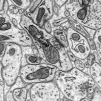
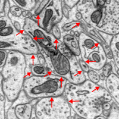
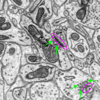
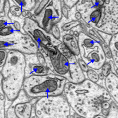
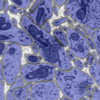
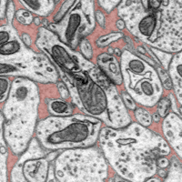
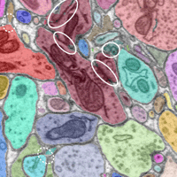

# Basic Introduction to EM Raw Data Images using Annotated Samples

## Raw EM Data from a Single Cutting Plane

EM Data is grayscale data created by collecting back-scattered electrons from the surface of a block of nervous tissue. The aspects of the EM acquisition determine the voxel resolution in these xy-planes. The 3rd dimension (z) of the volume is collected in SBEM by shaving off a very thin layer from the surface and concatenating the next acquired image with the previous. The minimum cutting thickness determines the voxel resolution in the z dimension.

## Annotation of Plasma Membranes (MEM)

Membranes are the most important aspect of segmentation since they represent the boundaries between neuronal and glial intracellular (ICS) volumes.

Sample MEM locations are annotated with red arrows.

## Annotation of Synapses and Vesicles

The location of synapses between neurons is of primary scientific interest because it represents the connectivity between neurons. Synaptic transmission is hypothesized to be the primary mechanism of information flow in nervous tissue.

Synapse locations are indicated by close contacts between adjacent membranes along with synaptic densities (circled in purple), darker areas along the membrane, and location of presynaptic vesicles (annotated with green arrows) that hold and release neurotransmitters into the synapse after an action potential occurs in the presynaptic neuron.

## Annotation of Mitochondria

Mitochondria are found within membranes and appear dark in color (typically darker than membranes). Mitochondria (mitochondria annotated with blue arrows) create energy for cells and are often found nearby to synapses.

## Labeling of Intracellular Space (ICS)

ICS voxels are those contained within membranes, encompassing all of the internal compartments of neurons and glia. Within ICS are vesicles, mitochonria and other organlles.

ICS pixels are colored in blue.

## Labeling of Extracellular Space (ECS)

ECS voxels are those found outside of membranes and inbetween the ICS areas of different cells. This area simply contains fluid (i.e., cerebrospinal fluid in nervous tissue from brain or central nervous system regions). Having more separation between ICS voxels can help with manual and automated segmentation of the raw EM data.

ECS pixels are colored in red.

## Segmented labeling of ICS

The end goal of the EMDRP is to segment different neurons by labeling ICS voxels of those neurons with unique integer labels. An example of an automated reconstruction is shown below where different colors represent different integer labels (and thus different neurons). Examples of mistakes are circled in white. If two neurons are merged together into the same label this is called a **merger**. If a portion of the same neuron is split between two or more labels, this is called a **split**.

