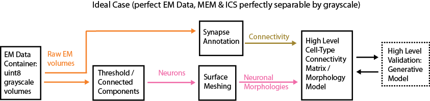
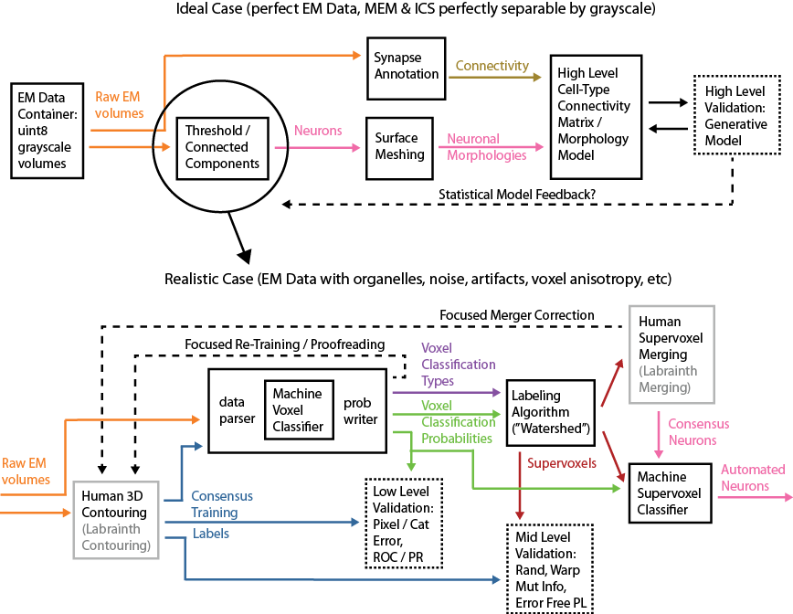
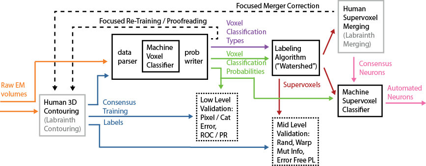

# EM Data Reconstruction Pipeline (EMDRP)

## Documentation

### EM Data
Electron microscopy (EM) data is collected in the [Briggman Lab (also CDCU)](https://neuroscience.nih.gov/ninds/Faculty/Profile/kevin-briggman.aspx) from blocks of [nervous tissue](https://en.wikipedia.org/wiki/Nervous_tissue) using the serial block face EM (SBEM) technique. SBEM is one of [several technologies](resources/EM_Methods_Bibliography.docx) for EM imaging of nervous tissue. The EM imaging data will typically be referred to in this documentation as the **raw data** or **raw EM data**.

EM imaging techniques all acquire volumes of data by acquiring a series of single imaging planes of nervous tissue. The overarching goal of the EMDRP is to segment these volumes so that shapes (morpohlogies) of nervous tissue cells ([neurons](https://en.wikipedia.org/wiki/Neuron) and potentially [glia](https://en.wikipedia.org/wiki/Neuroglia)) are reconstructed in 3D. Most commonly nervous tissue is imaged from brain areas, with the brain area and organism from which the nervous tissue is collected being determined by the particular scientific question of interest.

There are several essential aspects to be aware of regarding the raw EM data:
* EM imaging data is collected in serial slices of brain tissue in a single imaging plane (2D image, raw EM image). Sequential planes are concatenated along the 3rd dimension to form a dataset (3D volume, raw EM volume).
* Resolution in 2D slices (xy) is determined by the electron microsope. For SBEM, the 3rd dimension (z) is revealed by physically removing layers of the brain tissue sample using an ultrathin [microtome](https://en.wikipedia.org/wiki/Microtome) or ultramicrotome. Thus, resolution in the 3rd dimension (z) is determined by the minimum slice cutting thickness. Single imaging location elements in 2D images are referred to as pixels and in 3D volumes are referred to as voxels. Currently, a typical voxel resolution is 9.8 x 9.8 x 25 nm (xyz).
* SBEM is based on [scanning electron microscopy](https://en.wikipedia.org/wiki/Scanning_electron_microscope), so that single pixels in each imaging plan are created by collecting back-scattered electrons from a particular raster scanning location of the electron beam on the surface of the tissue.
* Raw EM data volumes contain *intracellular space* (**ICS**) which represents the insides of neurons and glial cells. It contains [organelles](https://en.wikipedia.org/wiki/Organelle) that are encompassed within *[plasma membranes](https://en.wikipedia.org/wiki/Cell_membrane)* (**MEM**) which separate cells apart from each other. In some volumes there can be space between membranes that is outside of the cells, referred to as the *[extracellular space](https://en.wikipedia.org/wiki/Extracellular)*  (**ECS**).
* The exact composition of raw EM volumes is determined not only by the EM imaging methodology, but also the method of [preparing and staining](resources/EM_Methods_Bibliography.docx) the brain tissue so that it has contrast in the raw EM images. EM contrast is obtained by staining the tissue with heavy metals (typically osmium).
* Raw EM data is stored as *single byte (uint8)* **grayscale data**. Membranes and organelles appear as dark (closer to 0 grayscale value) and ICS/ECS appear as light (closer to 256 grayscale value).
* Current EM acquisition technology allows for volumes on the order of 10 x 10 x 1 mm to be collected in a reasonable amount of time (weeks to months time frame for data acquisition).

Some [introduction](EMSamples.md) is required to become familiar with the raw EM data and the relevant structures in the images in regards to segementing neuronal (and glial) volumes. Such an introduction is also intended to be incorporated into an introductory tutorial for the [labrainth frontend website](#labrainth-frontend-website).

### EMDRP Motivation

The overall scientific goal for acquiring raw EM data of nervous tissue is to create a high level model of neuronal [synaptic](https://en.wikipedia.org/wiki/Synapse) and [electrically coupled](https://en.wikipedia.org/wiki/Electrical_synapse) connectivity, typically represented as a connectivity matrix between different neuron cell types. Cell types in this connectivity matrix are associated with a statistical or generative model of 3D morphology. This approach to neuroscience has been dubbed with the keyword [connectomics](https://en.wikipedia.org/wiki/Connectomics).

In an ideal world the raw EM data meet at least these criteria:
* MEM/ECS and ICS voxels are perfectly separable based on their grayscale values
* cell membranes are continuous in 3D and fully surround ICS areas of each cell
* there is no variance in z-slice thickness across or within xy image planes
* synapses are easily annotated in an automated way based on [synaptic density](https://en.wikipedia.org/wiki/Postsynaptic_density) grayscale values and shape.

For this **Ideal Case** raw EM data (outlined in schematic below), 3D morphologies are easily obtainable by thresholding the raw EM data, running a 3D [labeling or connected components algorithm](https://en.wikipedia.org/wiki/Connected-component_labeling) so that each neuron is represented with a unique label and then creating a [surface mesh](https://en.wikipedia.org/wiki/Polygon_mesh) for each labeled neuron.

The ideal case raw EM data does not currently exist and in the real world the data is subject to several known sources of noise and image artifacts:
* For scientific inquiry reasons, it is desirable to acquire raw EM data such that it contains organelles within the ICS regions. These organelles, particularly [mitochondria](https://en.wikipedia.org/wiki/Mitochondrion) typically contain grayscale values darker than the membranes.
* Electron microscopy is subject to [shot noise](https://en.wikipedia.org/wiki/Shot_noise) and other sources of noise. Signal-to-Noise ratio can be controlled based on acquisition parameters to some extent, but some level of noise will always be present in the acquired images.
* Due to the darker organelles and noise in the data there is a high degree of overlap in the histogram of grayscale values for MEM, ICS and ECS categorized voxels.
* Cutting artifacts from the ultramicrotome and issues resulting from the tissue preparation and staining can often cause disruptions in the plasma membranes. These results in artifacts in the image where the membrane is either very light in a particular region or sometimes not present at all in the EM image (*membrane gap*). The fine details of plamsa membrane continuity and intact celluar components in the EM images is referred to as **ultrastructure**.
* The ultramicrotome is designed to attempt to maintain a consistent thickness in the z-direction, but this technique is not perfect. This results in some variation in the z-resolution in the EM volumes, both between z-slices and within z-slices.
* The voxels are highly anisotropic (larger in z-direction typically by a factor of at least 2 relative to the xy or scanning direction) due to the minimum slice thickness limitation of the ultramicrotome.

Because current raw EM data does not fit the ideal case, in order to reconstruct 3D neuronal morphologies volumes must either be:
1. **manually annotated** by humans (also referred to as *labeled, colored, traced or contoured*) so that different neurons are colored with different values
2. **automatically reconstructed** by computers in such a way that allows for recognition of ICS versus MEM/ECS areas despite the noise / artifacts present in the data

Manual annotation of large volumes of EM data has *two major issues*:
1. The task is extremely labor intensive. Labeling even a small animal whole brain is essentially [intractable](resources/EM_Science_Bibliography.docx).
2. Manual labeling is subject to annotator error, so multiple annotators must label that same EM volumes and these must be compared so that mistakes can be fixed. Labels that represent the combined effort of several manual annotations are referred to as *consensus* labels.

[Automated Reconstruction](resources/EM_Reconstruction_Bibliography.docx) ideally is able to overcome the intractability of manually annotating data. Because there is no algorithmic method for fully [segmenting](https://en.wikipedia.org/wiki/Image_segmentation) image data in noisy EM volumes, this approach must be tackled using techniques from [machine learning](https://en.wikipedia.org/wiki/Machine_learning) and in particular from [machine vision](https://en.wikipedia.org/wiki/Machine_vision). Current state-of-the-art machine vision approaches still result in segmentations that have much higher error rates than manual annotations. Additionally, the [acceptable error rates](resources/EM_Methods_Bibliography.docx) for segmenting EM data into neuronal compartments are very very low, so a *hybrid of manual and automated approaches* [has been proposed](http://www.ncbi.nlm.nih.gov/pubmed/20801638). The remainder of this documentation will focus on the particular implementation of this strategy utilized in the Briggman Lab.

### EMDRP Overview

For **Realistic Case** raw EM data, the EMDRP highlighted in the schematic below (EMDRP schematic) replaces the easy segmentation of the ideal case raw EM data with a series of automated and manual techniques in order to create unique labels for different neurons in the raw EM volumes. Once completed these labels are easily integrated into the *Ideal Case* schematic at the point of creating surface meshes for 3D neuronal morphologies.

TODO: add skeletonizations (Knossos) in as part of paradigm, likely continue to use EFPL going forward, so this is an essential annotation component

Components of the *Realistic Case* EMDRP schematic are described briefly in the table below, with links to further module-specific documentation:

| **Component**      | **Schematic Depiction** | **Short Description**                  |
|:-------------------|:------------------------|:---------------------------------------|
| [EM Data Container](#em-data-container) | black | format for storage of raw EM data and other voxel-level data |
| [Labrainth Website](#labrainth-frontend-website) | (light gray) | website for human manual data annotation tasks |
| [Machine Voxel Classifier](#machine-voxel-classifier) | black | automated (machine learning) method for categorizing individual voxels, exports voxel classification types and probabilities |
| [Labeling Algorithm](#labeling-algorithm) | black | algorithmic image processing method for creating supervoxel labels based on machine voxel classifier type / probability outputs |
| [Machine Supervoxel Classifier](#machine-supervoxel-classifier) | black | automated (machine learning) method for classifiying (merging) supervoxels to create complete neuron labels |
| [Validation Metrics](#validation-metrics) | dashed boxes | metrics for evaluating segmentation performance typically compared with manual ground truth annotations |
| [Surface Meshing](#surface-meshing) | black | create surfaces of neuronal morphologies out of segmented neuronal volumes |
| [Feedback Paths](#feedback-paths) | dashed lines | methods of feeding back automated or manually created information to improve classification, reinforcement learning? |

#### EM Data Container

[HDF5](https://www.hdfgroup.org/HDF5/) has been chosen as the format for storage of raw EM data and also for [other data objects](#other-emdrp-data-formats) utilized in the pipeline.

Raw EM data for a single imaged block of tissue is referred to as a *dataset*. Each raw data hdf5 file contains volume data for the entirety of a single dataset within a single hdf5 dataset. Currently datasets are on the order of 106 pixels in the xy (scanning) directions with on the order of 105 z-slices acquired, corresponding to raw EM data volumes in the terabyte range and to a tissue volume size on the order of 10 x 10 x 1 mm. The data is stored with hdf5 chunking enabled. Chunking is required in the hdf5 so that compression can be enabled. This offers about 10% compression for the raw EM data, but in particular offers very high compression rates for label data (over 90%). The hdf5 chunk size has been chosen to be consistent with the raw EM "chunk" size that is used by the software [Knossos](http://www.knossostool.org/), for reasons of back-compatibility with existing software.  

Label data for segmented neurons is also stored in hdf5 format at the voxel level so that it is parallel with the raw EM dataset volume. Labels are always stored as unsigned integers (for compatibility with Imagej), mostly typically of size uint16, but for largers areas uint32 or possibly uint64 is required. Collections of voxels that have the same label value, but do not make up an entire area of ICS for a particular neuron, instead comprising components of a single neuron, are referred to as supervoxels, [the 3D analog of superpixels](https://en.wikipedia.org/wiki/Image_segmentation).

A [specification](EMDataContainer.md) for the format and usage requirements for the EM Data Container is being developed with the goal of a consistent and comprehensive data container API for the EMDRP. This specification must also meet the requirements for the other [data formats](#other-emdrp-data-formats) utilized by the EMDRP.

#### Labrainth Frontend Website

The [labrainth](https://labrainth.ninds.nih.gov) website, typically referred to in this documentation as the "frontend", is a website developed in order to [crowdsource](https://en.wikipedia.org/wiki/Crowdsourcing) some aspects of manual annotation of raw EM volumes. The website currently offers two modes of manual EM annotation:
1. the contouring task (Human 3D Contouring in schematic) where website users label ICS regions of neurons at the voxel level
2. the merging task (Human Supervoxel Merging in schematic) where website users merge together pre-created 3D sets of voxels, referred to as supervoxels

The website has been developed with elements of a computer game, in an attempt to motivate users to complete these labor intensive manual tasks. The second mode was heavily inspired by a previous crowd sourcing [project](https://eyewire.org) for merging together supervoxels.

The word "frontend" is used in order to distinguish elements of the website, which itself contains client-side and server-side components, from the rest of the EMDRP. The remainder of the EMDRP that is not associated directly with the frontend is typically referred to as the "backend" (i.e., this repository). The website is developed based on an SQL database [schema](frontend-wiki/resources/DatabaseIntro.pptx), so communication between the frontend and the backend is performed via SQL database queries and inserts (typically from python scripts associated with the backend) and via the hdf5 data containers (both for raw EM data and label data).

Some items to fill out with further discussion:
- python script for smoothing raw data for viewing for contouring task
- python script for surface meshing versus on-the-fly meshing currently implmemented
- python scripts for calculating consensus metrics for both tasks
- "three modes"
    1. single user score against consensus (calculate a single users score, insert score)
    2. all users scores against consensus (calculate the "consensus metric", insert metric and consensus)
    3. retreive all consensus objects for a given frontend cube (BPC_ID), write hdf5

TODO: more information need in this section:
- linking to a separate wiki in frontend describing python tools and details on the communication between frontend and backend
- linking to a separate wiki describing details of website implementation?
- what kind of webserver and database are deployed? supported?

TODO: start divorcing from website details? maybe add description of standalone tools or other web tools to be used going forward for manual annotation?

#### Machine Voxel Classifier

The first step of the proposed architecture is classifying the each voxel of the raw EM data as belonging typically to one of the three types discussed above: membrane (MEM), intracellular space (ICS) or extracellular space (ECS). This first step "cleans up" the raw EM data substantially by exporting a voxel level probability volume (light green *Voxel Classification Probabilities* in EMDRP schematic) parallel to the raw EM data volume. This probability volume can then be segmented into labels using more standard image processing algorithm approaches, such as the [watershed](https://en.wikipedia.org/wiki/Watershed_%28image_processing%29). This [label or supervoxel creation](#labeling-algorithm) portion of the EMDRP is discussed in more detail below.

The current choice of implementation for the machine voxel classifier is using a [convolutional neural network](https://en.wikipedia.org/wiki/Convolutional_neural_network) architecture to classify each voxels as belonging to a particular voxel type of interest (i.e., MEM, ICS, ECS). Currently the EMDRP is using [Intel Nervana neon](https://github.com/NervanaSystems/neon) with a [harness](convnet-wiki/README.md) for processing EM data. Previous classifications were done with a [modified version](../../cuda-convnet2) of [cuda-convnet2](https://github.com/akrizhevsky/cuda-convnet2).

#### Labeling Algorithm

The labeling algorithm component of the EMDRP takes classification probabilities and types for each voxel and converts them into 3D label "chunks" referred to as supervoxels. Supervoxels are not typically complete neurons because the performance of the machine voxel classifier is not good enough to meet acceptable error rates for segmenting neuronal tree morphologies. Instead these chunks are ideally made as large as possible so that there is a high degree of confidence that they do not contain an labels that would end up segmenting two different neurons into the same object, referred to as a **merger**. Instead these are usually over-segmented objects, i.e. each neuron contains many supervoxels. Extra supervoxels contained within a neuron due to the over-segmentation are referred to as **splits**.

This algorithm does not utilize any machine learning techniques, but instead is essentially a variant of a watershed algorithm. These same approach could be applied to the raw EM data; however, the output of the machine voxel classifier represents a much "cleaner" version of whatever the categories of interest are, relative to the *Realistic Case* EM data. Indeed some other groups working on segmentation of brain tissue EM simply create an over-segmented set of supervoxels from the raw EM data itself, bypassing the machine voxel classifier step. However, much larger supervoxels (i.e., less splits) can be created by utilizing machine learning for the voxel classification, so that is why this strategy is employed in the EMDRP.

The current approach is to take the probability outputs of multiple trained convnets (the machine voxel classifier) and merge then into a probability volume for each voxel type of interest, namely MEM, ICS and ECS. Currently probabilities are merged by a weighted average of networks trained in different [reslice](convnet-wiki/EMDataParser.md) directions (xyz, xzy, zyx). Merging is implemented by ``dpAggProbs.py`` and ``dpMergeProbs.py``.

The first step of this watershed method is to take an argmax over the voxel type probabilities. This assigns each voxel to a voxel type (i.e., MEM, ICS, ECS) as a winner-take-all from the convnet probability outputs. These voxel types are conserved by this watershed algorithm, meaning that if a particular voxel was labeled as MEM, for example, based on the winner-take-all of the convnet probabilities then it will still be MEM at the output of the watershed.

The current implementation of labeling algorithm is essentially an iterated series of connected component labeling using increasing thresholds of the voxel classification probabilities. Currently a [hand drawn diagram](images/watershedtypes_sketch.jpg) documents these steps. The labeling algorithm is implmemented in ``dpWatershedTypes.py``.

*Preliminary pseudocode with illustration*

TODO: work on this, use pseudocode or words with images for each step?

1. Create a single volume of *Voxel Classification Type*, assigning each voxel to one of the types of interest. By default the types are MEM (background type), ICS and ECS (foreground types). Each voxel is assigned to the winning type, i.e., the type with the greatest probability of membership. This is referred to as winner-take-all, and although is often implemented by the output function of the machine classifier itself ([softmax](https://en.wikipedia.org/wiki/Softmax_function)) it is done here to support [multiple independent](cuda-convnet2-EM-wiki/EMDataParser.md) outputs and [Bayesian reweighting](cuda-convnet2-EM-wiki/EMDataParser.md) of outputs in the convnet.

TODO: didn't write any documentation details for those features of the convnet yet

2. Initialize / define inputs
    Ts <-- sorted list (ascending) of probability thresholds (input)
    Tmin <-- minimum component size (input)
    sz <-- shape of the volume being labeled (input)
    Pi <-- probability volumes with shape sz for each type (input)
    W <-- type for each winner-take-all voxel
    B <-- empty binary mask with shape sz

3. Assign probabilities of non-winning voxels to zero
    - for each T in types (MEM, ICS, ECS) count i
        - P(i) <-- 0 at voxels where W is not T

4. Iterate over input thresholds and run connected component labeling at each step
    - for each T in Ts, count i
        - for each F in foreground types (ICS, ECS), count j
            - TP <-- probability of F > T
            - C(j) <-- connected components of (TP OR B)
            - B <-- B OR (connected components of TP with size < input Tmin)
            - use binary warping to expand C(j) towards filling F voxels of W
            - assign remaining unlabeled in C(j) that are F voxels of W to nearest neighbor label
        - C <-- merge Ci, guaranteed not to overlap because of step (3)
        - save C as supervoxels created at threshold T

TODO: some discussion of other potential approaches, particularly affinity graph

#### Machine Supervoxel Classifier

The purpose of the second step of machine learning is to come up with a learnable scheme for how to *merge* together supervoxels created from the labeling step that represent an over-segmentation of neurons. This method is preferred over attempting to split apart supervoxels containing mergers because it is generally agreed that the problem of splitting mergers in 3D is inherently more difficult than merging. The approach of *agglomerating* together over-segmented superpixels is also a step frequently utilized in 2D image processing segmentation problems.

Currently the best method for agglomerating supervoxels in the EMDRP is still being investigated. The current front-running approach / implementation is [GALA](https://github.com/janelia-flyem/gala) due to easily available code and a general methodology that has been supported by more than one group working on segmenting EM data. GALA is implemented in python and full [documentation](https://gala.readthedocs.org/en/latest/) and [forum](http://gala.30861.n7.nabble.com/) support is also available.

#### Validation Metrics

*Low Level Validation Metrics*

- pixel error, aka categorization or classification error
- pixel fscore

*Mid Level Validation Metrics*

- rand error
- warping error
- skeleton node based rand error
- error free path lengths

*High Level Validation Metrics*

- generative morphology model?
- future work

TODO: detail here on each metric and existing implementations

#### Surface Meshing

Currently in ``recon/python/dpLabelMesher.py`` using vtk rendering pipeline from python.

TODO: way more detail here, include some discussion of javascript meshing for frontend?

#### Python class hierarchy

Besides the convnets, the majority of the rest of the EMDRP code is as a [python class hierarchy](images/EM_pipeline_python_class_hierarchy.png) that inherits from a base class for loading data out of the hdf5 data containers. Most python classes also implement a command line interface which make up the steps in the [pipeline workflow](resources/EM_pipeline_workflow.docx).

TODO: more detail here and future directions, developing into actual module?

#### Feedback Paths

TODO: this is future work, currently only some hooks for proofreading, for example, are implemented

#### Other EMDRP Data Formats

The EMDRP also contains other data representations which are also stored in the hdf5 data container.

| **EM Data Representation** | **Schematic Depiction** | **data type** | **Short Description**  |
|:---------------------------|:------------------------|:--------------|:-----------------------|
| [Raw EM Volumes](#em-data) | orange | uint8 | raw EM data |
| Consensus Training Labels | blue | uint16 | manually colored ground truth labels |
| Voxel Classification Type | purple | uint8 enum | value encoding different voxel types of interest (typically MEM==0,ICS==1,ECS==2) |
| Voxel Classification Probability | green | float32 |  probability that a voxel is of a particular classification type |
| Supervoxels | red | uint16/32/64 | automatically segmented portions of neurons or glia |
| (Consensus/Automated) Neurons | pink | uint16/32/64 | segmented volumes of single neurons or glia |

TODO: lots more detail here and also links to the frontend scripts, OR maybe just integrate these in with the corresponding EMDRP components that utilizes them??? OR, link out to EMDataContainer.md (the specification)

### EMDRP Standalone Tools

* Fiji / Imagej
* Knossos
* ITKsnap
* Matlab
* Adobe Photoshop / Illustrator

TODO: discussion of a in-house single standalone tool that would integrate components of Knossos and ITKsnap plus easily read/manupulate em data containers (hdf5)

### Other data formats

EMDRP standalone tools are not all supporting either reading hdf5 at all or in particular reading out subregions from hdf5 datasets, so other "intermediate" formats are often utilized. For volume data:

* raw
* nrrd
* gipl
* tiff

For image data or for displaying plots:

* tiff
* jpeg
* png
* eps

TODO: more information here on which programs use which formats, reading / writing utilities, etc

## Project Planning

Currently EMDRP project planning is mostly contained in a single milestones [document](resources/EM_Reconstruction_Roadmap.docx) written by Dr. Briggman.

TODO: update the milestones document with more recent notes

TODO: create some tables here to integrate the items from the milestones, include descriptions of what is complete, who is assigned, timeframes, etc?

TODO: more project planning with an emphasis on timeframes / component dependencies

TODO: integration with Jira or some project planning software / bug tracking software?

## Version Control

TODO: help me

## Directory Layout

TODO: should this be a separate section or incorporated into above component sections? maybe include a table here or some kind of tree view?

## Documentation Tools

The "wiki" documents were created in github flavored markdown (gfm). Markdown files are saved as `*.md`. This document was created using [atom](https://atom.io/).
Different portions of the pipeline are saved in `[component_name]-wiki`.
Under each "wiki", subfolders:
- `images/` contains browser readable image or other inline rendered files
- `resources/` contains non-browser readable files (e.g., word or powerpoint documents)

The markdown pages can be viewed without a server-side rendering by using browser plugins for rendering markdown or tools for converting markdown to html. For example:
- https://chrome.google.com/webstore/detail/markdown-preview-plus/febilkbfcbhebfnokafefeacimjdckgl?hl=en-US

Additionally, the markdown content can be converted for viewing using the script `genhtml.sh` which relies on perl and [pandoc](http://pandoc.org/). The script will convert all `*.md` into html and replace all links to `*.md` files with correpsonding `*.html`.

TODO: more detail here, low-level documentation? doxygen?

## Computing Resources

Currently all computing resources for the backend (machines, CPU nodes, GPUs) are housed within the CDCU. A shared [file server](smb://nindsdir35fs1.ninds.nih.gov/CDCU) is utilized for storage of EM and lab data.

EMDRP backend code is designed for linux platform, specifically RHEL or CentOS, versions 6.5 and later. A [text document](computing-wiki/resources/HOWTO_setup_convnets_server.txt) is being maintained with a list of all steps required to setup a workstation to run different aspects of the EMDRP. Although the majority of the code is implemented in python using [numpy/scipy](http://www.scipy.org/), some portions are implemented in Matlab, and highly optimized portions written in C/C++ and/or using [CUDA](http://www.nvidia.com/object/cuda_home_new.html) for GPU-acceleration.

TODO: fill out this section better including:
- table of machines with their available resources
- information about CIT maintenance / visibility for being on ninds network
- information about [biowulf](https://hpc.nih.gov/docs/userguide.html), other cluster resources
- replace the HOWTO with a markdown wiki in the computing-wiki subdirectory
- ninds IT and CIT contacts

## Contributors

#### Briggman Lab
- [Paul Watkins](mailto:paul.watkins@nih.gov)
- [Hailiang Zhang](mailto:hailiang.zhang@nih.gov)
- [Kevin Briggman](mailto:kevin.briggman@nih.gov)

#### Website Development
- [Amarendra Yavatkar](mailto:yavatka@ninds.nih.gov)
- [Mayur Joshi](mailto:joshim2@ninds.nih.gov)
